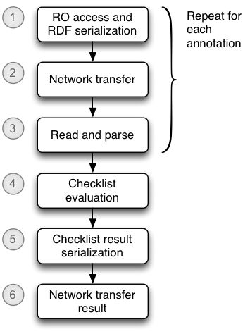

# Checklist performance evaluation

## Evaluation  plan

### Processing model

#### 1. RO access and serialization of annotations

RODL stores some RDF internally in a triple store, and serializes on demand.  I'm not sure if this applies to annotations.

#### 2. Network transfer of serialized RDF annotations

This appears to be a factor affecting performance, but I'm not sure if it is really meaningful to try and separate this.  I see it as an RODL rather than checklist performance copncern.

#### 3. Checklist processor read and parse RDF annotations

From informal observations, this appears to be one of the performance constraining factors for checklist evaluation.  Each time a checklist is evaluated, the RDF annotations from the RO need to be read and parsed into an internal graph.

A key purpose of these performance tests is to gather evidence for or agasinst this hypothesis.

#### 4. Checklist evaluation: queries to local graph of RDF annotations

This includes creation of an internal RDF graph containing the results, but not serialization of that graph.  I don't believe this to be a performance-constraining element.

#### 5. Serialize checklist evaluation result

Serialization of the result graph to some RDF serialization.

#### 6. Network transfer of serialized result

### Candidiate variations to evaluate

1. Different total size of annotations: 10Kb, 100Kb, 1Mb, 10Mb
2. Different numbers of individual annotations: 1, 10, 100, 1000
3. Local vs remote access
4. Different RDF serialization formats?

### Test cases

* A. Full checklist evaluation from RODL

    Tests all steps 1-6.

* B. Full checklist evaluation from local store, accessed locally

    Tests steps 3-5 (*plus* file access time, which is assumed to be discountable for this purpose)

    Adding instrumentation to the checklist web service should help us to separate the checklist evaluation time

* C. Full checklist evaluation from local store, accessed remotely

    Tests steps 3-6 (*plus* file access time, which is assumed to be discountable for this purpose)

* D. Curl retrieval of annotations from RODL

    Tests steps 1-2

* E. `ro dump` from RODL

    Tests 1-3 _plus_ serialization of merged annotation graph

    Adding some instrumentation to RO manager could allow the serialization element to be separated

These measurements would allow us to isolate values for:

* steps 1+2
* step 3
* steps 4+5
* step 6

In designing these tests, I am not addressing the auxiliary services that format the results for use in a web page.

If results indicate that parse/serialization time is a factor, we might then wish to explore different serialization formats.

# Scripts and code used

@@TODO

# Results

<table border="1" bordercolor="#D3D1D1" cellpadding="2" cellspacing="0">
    <tr>
        <td></td>
        <td colspan="5">Test cases</td>
    </tr>
    <tr>
        <td>Annotation size</td>
        <td>A</td>
        <td>B</td>
        <td>C</td>
        <td>D</td>
        <td>E</td>
    </tr>
    <tr>
        <td>10KB</td>
        <td></td>
        <td></td>
        <td></td>
        <td></td>
        <td></td>
    </tr>
    <tr>
        <td>100KB</td>
        <td></td>
        <td></td>
        <td></td>
        <td></td>
        <td></td>
    </tr>
    <tr>
        <td>1MB</td>
        <td></td>
        <td></td>
        <td></td>
        <td></td>
        <td></td>
    </tr>
    <tr>
        <td>10MB</td>
        <td></td>
        <td></td>
        <td></td>
        <td></td>
        <td></td>
    </tr>
    <tr>
        <td>10 x1KB</td>
        <td></td>
        <td></td>
        <td></td>
        <td></td>
        <td></td>
    </tr>
    <tr>
        <td>100 x 1KB</td>
        <td></td>
        <td></td>
        <td></td>
        <td></td>
        <td></td>
    </tr>
    <tr>
        <td>1000 x 1KB</td>
        <td></td>
        <td></td>
        <td></td>
        <td></td>
        <td></td>
    </tr>
    <tr>
        <td>10000 x 1KB</td>
        <td></td>
        <td></td>
        <td></td>
        <td></td>
        <td></td>
    </tr>
</table>

